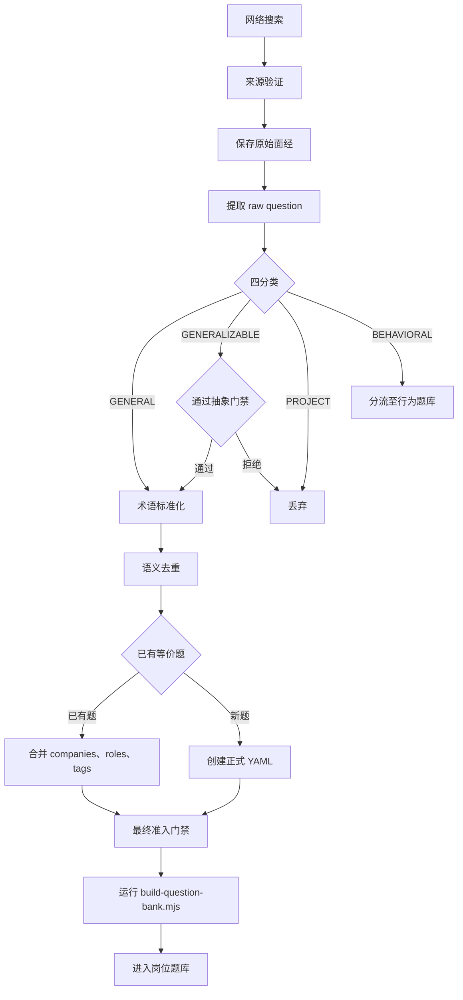

# 岗位题库网络采集 Workflow

本规范适用于人工采集、Agent 批量采集与代码自动校验。采集过程分为原始面经层和正式题库层：原始面经层保存证据与追溯信息，正式题库层提供学习与练习内容。

## 1. 来源门禁

每条面经至少必须包含：

- 公司；
- 岗位；
- 来源平台；
- 来源账号或者发布者标识。

建议同时补充：

- 年份或届次；
- 面试轮次；
- 原作者身份情况。
- 原始链接。

来源优先级：

1. 原作者面经；
2. 明确转载或授权整理；
3. 可追溯二次整理；
4. 培训号汇总。

原始链接允许留空。原作者身份未知时，使用平台 UP 主作为发布者标识，并将来源类型记录为“平台 UP 主整理”。缺少公司、岗位、来源平台或者发布者标识的内容不能进入正式候选。

## 2. 原题提取

采集时先保存原始问题，完成证据留存后再加工题目。原始数据必须区分以下字段：

```yaml
raw_question: 原始问题
canonical_question: 标准化问题
```

> 先保存证据，再加工题目。

## 3. 强制分类

每道原题必须归入以下四类之一：

| 分类 | 含义 | 处理方式 |
| :--- | :--- | :--- |
| `GENERAL` | 通用知识题 | 进入正式技术题库候选 |
| `GENERALIZABLE` | 项目相关，并且可以安全抽象为通用知识 | 通过抽象门禁后进入候选 |
| `PROJECT` | 强项目相关 | 丢弃 |
| `BEHAVIORAL` | HR、行为、团队或职业规划题 | 分流至行为题库 |

正式技术题库只处理 `GENERAL` 与 `GENERALIZABLE`。

## 4. 项目题抽象门禁

项目题只有同时满足以下条件才允许抽象：

1. 去掉项目背景后，问题仍然成立；
2. 抽象后的知识具有跨公司、跨项目和跨细分方向的复用价值。

允许抽象的示例：

```text
原题：你项目中 MOSFET 为什么选这个型号？
标准题：功率 MOSFET 选型需要关注哪些关键参数？
```

“你项目里的某三相拓扑为什么这样控制？”过度依赖具体项目，应当直接丢弃。

::: danger 抽象边界
只允许去除项目上下文，严禁扩大原题考察范围。
:::

## 5. 标准化

统一专业术语、大小写、中英文名称和提问方式。

| 原始表达 | 标准表达 |
| :--- | :--- |
| MOS 管 | MOSFET |
| 压白率 | 压摆率 |
| 反击变换器 | 反激变换器 |

无法确认的语音识别内容必须标记为“待确认”，严禁猜测。

## 6. 语义去重

创建正式 YAML 前必须查询现有岗位题库。以下问题应当映射到同一道标准题：

```text
MOS 管选型看什么？
MOSFET 选型有哪些参数？
功率 MOSFET 应如何选型？
```

统一映射为：

```text
功率 MOSFET 选型需要关注哪些关键参数？
```

发现等价题时，不新增题目，只合并 `companies`、`roles` 和 `tags`，必要时补充答案。

## 7. 正式 QuestionBank 数据规则

正式题目 YAML 保持以下结构：

```yaml
id:
question:
roles:
companies:
topic:
tags:
answers:
```

字段语义固定如下：

- `question`：标准化后的 canonical question；
- `roles`：应当学习这道题的岗位，来源岗位和适用岗位需要分别判定；
- `companies`：真实面试中验证过该题或等价知识点的公司；
- `topic`：唯一的一级专题，必须使用受控专题表；
- `tags`：一级专题下的一至三个知识分类，必须使用受控标签表；
- `answers`：NoteHub 提供的不同岗位视角答案，与来源公司无关。

大量采集元数据不得写入正式题目 YAML。

### 参考回答格式

每个岗位视角使用相同的 Markdown 结构：

```yaml
answers:
  hardware: |-
    ## 作答要点
    - 先给出直接结论，并说明成立条件。
    - 再解释关键原理、判断依据或者设计取舍。
    - 最后说明工程验证方法、边界条件和常见风险。
    - 参考：[资料名称](https://example.com)。
```

格式要求如下：

1. 固定使用二级标题 `## 作答要点`，标题后直接使用无序列表；
2. 每个回答包含一至六条要点，每条只表达一个完整结论；
3. 要点按照“直接结论、关键原理、工程方法、验证与边界”的顺序组织；
4. 命令、寄存器、API、信号名称和计算式使用行内代码；
5. 参考资料放在最后一条，使用可访问的 Markdown 链接并写明资料名称；
6. 不添加“参考回答：”“答案：”等正文前缀；
7. 不使用更高层级标题、空标题、连续空行和嵌套列表；
8. 不虚构项目参数、实测结果、器件型号和来源链接；
9. 不同岗位视角分别回答该岗位负责的判断、操作和验证内容。

页面统一提供“参考回答”标题、岗位视角标签、正文间距、列表样式、代码样式和链接样式。答案正文只承载知识内容。

## 8. companies 合并规则

同一道 canonical question 被多家公司问过时，将公司名称合并到同一题目：

```yaml
companies:
  - 汇川技术
  - 锦浪科技
  - TP-LINK
```

同一道题目只保留一个正式 YAML，`companies.length` 表示该题的公司覆盖度。

## 9. tags 受控规则

采集过程中严禁随意创造同义标签。例如 `MOS`、`MOS管`、`MOSFET`、`功率MOS` 和 `功率管` 应当统一使用 `MOSFET`。

只有现有 taxonomy 无法表达新的知识领域时，才允许增加标签。增加前必须检查同义词、上下级关系和既有题目用法。

## 10. Raw Dataset 与正式题库分离

### 原始面经层

保存以下字段：

```yaml
company:
role:
year:
round:
platform:
url:
author:
source_type:
raw_question:
canonical_question:
classification:
```

原始面经层负责证据与追溯。

### QuestionBank

保存以下字段：

```yaml
id:
question:
roles:
companies:
topic:
tags:
answers:
```

QuestionBank 负责学习与练习。两个数据层必须分别保存。

## 最终准入门禁

一道题正式进入岗位题库前，必须完成全部检查：

- [ ] 来源平台与发布者标识明确；
- [ ] 公司明确；
- [ ] 岗位明确；
- [ ] 原始问题已经保存；
- [ ] 已经完成 `GENERAL`、`GENERALIZABLE`、`PROJECT`、`BEHAVIORAL` 分类；
- [ ] 题目不属于强项目相关题；
- [ ] 抽象过程没有扩大原题范围；
- [ ] 抽象后具有通用价值；
- [ ] 专业术语确认无误；
- [ ] 已经检查现有题库的语义重复；
- [ ] `roles` 设置合理；
- [ ] `companies` 已经合并；
- [ ] `tags` 使用受控词表；
- [ ] 答案符合对应岗位视角；
- [ ] `build-question-bank.mjs` 校验通过。

## 完整流程



## 核心规则

> **来源必须可追溯。**  
> **原题和标准题必须分开。**  
> **项目题默认不收，只允许有限抽象。**  
> **先查重，再新增。**  
> **正式题库只保留 canonical question，来源证据单独保存。**
